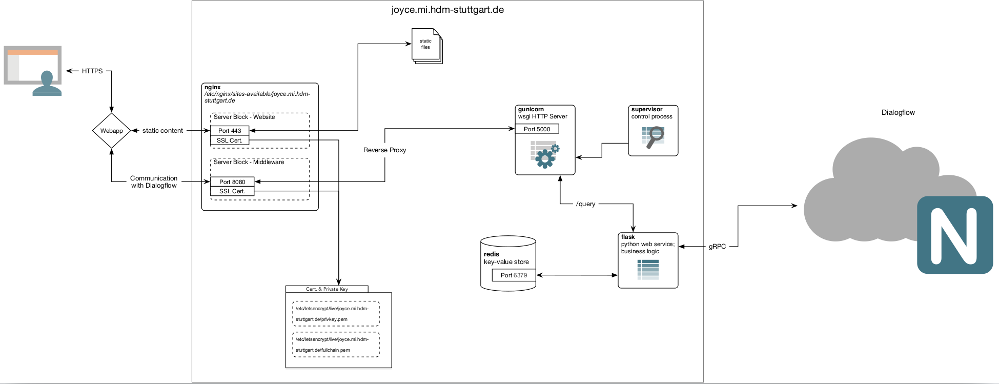

# Joyce - Dokumentation & Installationsanleitung



### Python Installation

Miniconda installieren:

1. Installer herunterladen: https://conda.io/en/master/miniconda.html

2. Miniconda installieren:

   ```bash
   bash Miniconda3-latest-Linux-x86_64.sh
   ```

3. Python 3.X Environment erstellen:

   ```bash
   conda create -n joyce python=3.6 
   ```

   * Alle Chatbot-Relevanten Skripte und Pakete werden in diesem Virtuellen Python-Environment installiert und ausgeführt:

     ```bash
     # Environmert benutzen
     source activate joyce
     
     # Environment verlassen
     deactivate
     ```

### Middleware Installation  

1. Joyce - Backend [Git-Repositoy](https://gitlab.mi.hdm-stuttgart.de/aa065/joyce---chatbot-zur-studienberatung.git) auschecken: 

   ```bash
   git clone https://gitlab.mi.hdm-stuttgart.de/aa065/joyce---chatbot-zur-studienberatung.git
   ```

2. Benötigte Pakete installieren:

   ```bash
   cd joyce--chatbot-zur-studienberatung
   pip install -r requirements.txt
   ```

3. Redis installieren und konfigurieren:

   ```bash
   sudo apt update
   sudo apt install redis-server
   ```

   * systemd für den Redis-Server aktivieren:

     ```bash
     sudo vim /etc/redis/redis.conf
     ```

     Die *supervised* Option in der redis.conf  auf *systemd* setzen:

     ```python
     . . .
     
     # If you run Redis from upstart or systemd, Redis can interact with your
     # supervision tree. Options:
     #   supervised no      - no supervision interaction
     #   supervised upstart - signal upstart by putting Redis into SIGSTOP mode
     #   supervised systemd - signal systemd by writing READY=1 to $NOTIFY_SOCKET
     #   supervised auto    - detect upstart or systemd method based on
     #                        UPSTART_JOB or NOTIFY_SOCKET environment variables
     # Note: these supervision methods only signal "process is ready."
     #       They do not enable continuous liveness pings back to your supervisor.
     supervised systemd
     
     . . .
     ```

     Folgender Befehl müsste jetzt funktionieren:

     ```bash
     sudo systemctl restart redis.service
     ```

     Als letztes das Redis Command Line Interface testen:

     ```bash
     redis-cli
     ```

     In dem Folgenden Command Line interface die Verbindung testen:

     ```bash
     127.0.0.1:6379> ping
     
     # Output
     PONG
     
     127.0.0.1:6379> exit
     ```

4. Flask-Applikation ausführen:

   ```bash
   cd joyce---chatbot-zur-studienberatung/middleware
   python main.py
   ```

   Wenn alles bis zu diesem Punkt richtig installiert und konfiguriert wurde, startet jetzt ein Web-Server mit folgender Konsolenausgabe:

   ```bash
    * Serving Flask app "main" (lazy loading)
    * Environment: production
      WARNING: Do not use the development server in a production environment.
      Use a production WSGI server instead.
    * Debug mode: off
   
   ```

5. Dieser Web-Server ist nur für Entwicklungszwecke geeignet. Für das produktive Deplyment ist in diesem Fall ein Python WSGI HTTP Server notwendig. In diesem Fall wurde **Gunicorn** verwendet.

   ```bash
   pip install gunicorn
   ```

   Der Serverprozess kann jetzt aus dem middleware-Verzeichnis gestartet werden:

   ```bash
   gunicorn main:application -b 0.0.0.0:5000 -w 4
   ```

   Wenn alles funktioniert hat, wird folgender Konsolenoutput zurückgegeben:

   ```bash
   [2019-01-28 12:05:31 +0100] [5239] [INFO] Starting gunicorn 19.9.0
   [2019-01-28 12:05:31 +0100] [5239] [INFO] Listening at: http://0.0.0.0:5000 (5239)
   [2019-01-28 12:05:31 +0100] [5239] [INFO] Using worker: sync
   [2019-01-28 12:05:31 +0100] [5242] [INFO] Booting worker with pid: 5242
   [2019-01-28 12:05:31 +0100] [5243] [INFO] Booting worker with pid: 5243
   [2019-01-28 12:05:31 +0100] [5245] [INFO] Booting worker with pid: 5245
   [2019-01-28 12:05:31 +0100] [5246] [INFO] Booting worker with pid: 5246
   ```

6. Der Server musste bis jetzt immer per Konsolenbefehl gestartet und gestoppt werden. Um den Prozess ordnugsgemäß zu verwalten, wird **Supervisor** verwendet. So ist es möglich, den Prozess im Hintergrund zu managen und auszuführen. Außerdem wird er bei Beendigung, sowie bei Systemstart automatisch gestartet.

   Supervisor installieren:

   ```bash
   sudo apt-get install supervisor
   ```

   Um den Gunicorn Prozess zu managen, muss ein neues supervisor-file in */etc/supervisor/conf.d* erstellt werden:

   ```bash
   sudo touch /etc/supervisor/conf.d/joyce.conf
   ```

   Folgenden Inhalt einfügen und speichern:

   ```bash
   [program:joyce]
   
   directory=/home/joyce/joyce---chatbot-zur-studienberatung/middleware
   command=/root/miniconda3/envs/joyce/bin/gunicorn main:application -b 0.0.0.0:5000 -w 4
   autostart=true
   autorestart=true
   stderr_logfile=/var/log/joyce/joyce.err.log
   stdout_logfile=/var/log/joyce/joyce.out.log
   ```

   Um die Änderungen wirksam zu machen, muss der Supervisor-Service neu gestartet werden. Eventuell müssen Verzeichnisse angepasst werden.

   ```bash
   service supervisor restart
   ```

   Wenn alles funktioniert hat, wird der Server jetzt im Hintergrund ausgeführt:

   ```bash
   $ service supervisor status
   ● supervisor.service - Supervisor process control system for UNIX
      Loaded: loaded (/lib/systemd/system/supervisor.service; enabled; vendor preset: enabled)
      Active: active (running) since Mon 2019-01-28 12:24:43 CET; 5s ago
        Docs: http://supervisord.org
     Process: 6670 ExecStop=/usr/bin/supervisorctl $OPTIONS shutdown (code=exited, status=0/SUCCESS)
    Main PID: 7138 (supervisord)
       Tasks: 6 (limit: 9480)
      Memory: 153.3M
      CGroup: /system.slice/supervisor.service
              ├─7138 /usr/bin/python /usr/bin/supervisord -n -c /etc/supervisor/supervisord.conf
              ├─7158 /home/dani/anaconda3/envs/joyce/bin/python /home/dani/anaconda3/envs/joyce/bin/gunicorn main:application -b 0.0.0.0:5000 -w 4
              ├─7162 /home/dani/anaconda3/envs/joyce/bin/python /home/dani/anaconda3/envs/joyce/bin/gunicorn main:application -b 0.0.0.0:5000 -w 4
              ├─7163 /home/dani/anaconda3/envs/joyce/bin/python /home/dani/anaconda3/envs/joyce/bin/gunicorn main:application -b 0.0.0.0:5000 -w 4
              ├─7164 /home/dani/anaconda3/envs/joyce/bin/python /home/dani/anaconda3/envs/joyce/bin/gunicorn main:application -b 0.0.0.0:5000 -w 4
              └─7165 /home/dani/anaconda3/envs/joyce/bin/python /home/dani/anaconda3/envs/joyce/bin/gunicorn main:application -b 0.0.0.0:5000 -w 4
   
   ```

7. **nginx** installieren und konfigurieren:

   nginx fungiert für die Middleware-Applikation als Reverse-Proxy. Zuerst muss nginx installiert werden:

   ```bash
   sudo apt-get install nginx
   ```

   Anlegen eines neuen Server-Blocks:

   ```bash
   sudo touch /etc/nginx/sites-available/joyce.mi.hdm-stuttgart.de
   
   # Neuen Server-Block aktivieren
   sudo ln -s /etc/nginx/sites-available/joyce.mi.hdm-stuttgart.de /etc/nginx/sites-enabled/joyce.mi.hdm-stuttgart.de
   ```

   Server-Block konfigurieren:

   ```bash
   # Frontend HTTPS redirection
   # Das Zertifikat wird von Letsencrypt zur Verfügung gestellt und ist bis zum 04.09.2019 gültig
   server {
           listen *:80;
           listen [::]:80;
           server_name joyce.mi.hdm-stuttgart.de www.joyce.mi.hdm-stuttgart.de;
           return 301 https://$server_name$request_uri;    
   }
   
   # Frontend HTTPS
   server {
           listen *:443 ssl;
           listen [::]:443 ssl;
           server_name joyce.mi.hdm-stuttgart.de www.joyce.mi.hdm-stuttgart.de;
           
           location / {
                   root /home/joyce/dist/chatbot;
           }
           
           ssl_certificate /etc/letsencrypt/live/joyce.mi.hdm-stuttgart.de/fullchain.pem; # SSL Zertifikat
           ssl_certificate_key /etc/letsencrypt/live/joyce.mi.hdm-stuttgart.de/privkey.pem; # SSL Private Key
           include /etc/letsencrypt/options-ssl-nginx.conf; # managed by Certbot
           ssl_dhparam /etc/letsencrypt/ssl-dhparams.pem; # managed by Certbot     
   
   }
   
   # Middleware
   server {
           listen *:8080 ssl; 
           server_name joyce.mi.hdm-stuttgart.de www.joyce.mi.hdm-stuttgart.de;
           ssl_certificate /etc/letsencrypt/live/joyce.mi.hdm-stuttgart.de/fullchain.pem; # managed by Certbot
           ssl_certificate_key /etc/letsencrypt/live/joyce.mi.hdm-stuttgart.de/privkey.pem; # managed by Certbot
           include /etc/letsencrypt/options-ssl-nginx.conf; # managed by Certbot
           ssl_dhparam /etc/letsencrypt/ssl-dhparams.pem; # managed by Certbot     
                   
       location / {
           proxy_pass http://0.0.0.0:5000;
       }
   }
   ```

   Der Middleware-Service ist jetzt über den Port 8080 per SSL von außen erreichbar. 

   Das Joyce-Frontend ist als statische Dateiensammlung auf **/home/joyce/dist/chatbot** verfügbar. Der Webserver lädt diese Dateien und stellt sie auf Port 443 zur Verfügung.

   Um das Frontend zu bauen, muss das Git-Projekt (Frontend) zuerst ausgecheckt werden:

   ```bash
   git clone https://gitlab.mi.hdm-stuttgart.de/tt031/joyce.git
   ```

   Das Frontend basiert auf Angular 7. Die statischen Dateien können mit

   ```bash
   ng build --prod		
   ```

   erstellt werden.

   ## Dateipfade

   * **Frontend**: /home/joyce/dist/chatbot
   * **Middleware**: /home/joyce/joyce---chatbot-zur-studienberatung/middleware
   * **Supervisor**: /etc/supervisor/conf.d/joyce.conf
   * **Log-Files - Middleware**: /var/log/joyce/joyce.err.log
   * **Python-Environment**: /root/miniconda3/envs/joyce/
   * **Redis Config Files**: /etc/redis/redis.conf
   * **nginx Server Block**: /etc/nginx/sites-available/joyce.mi.hdm-stuttgart.de
   * **SSL-Public Key**: /etc/letsencrypt/live/joyce.mi.hdm-stuttgart.de/fullchain.pem
   * **SSL-Private Key**: /etc/letsencrypt/live/joyce.mi.hdm-stuttgart.de/privkey.pem

   ## Ports

   * **Frontend**: 443/80

   * **Middleware (nginx)**: 8080

   * **Middleware-Service**: 5000

   * **Redis**: 6379

     

   Der Middleware-Service berechnet die monatlichen Cloud-Kosten des Chatbots und blockiert alle eingehenden Requests, sobald ein bestimmter Betrag (im Moment sind es 10$) erreicht wurde. In der *definitions.py* des Middleware Services kann dieser Betrag, sowie weitere Optionen, eingestellt werden.

   Um die Blockierung aufzuheben, muss die Anzahl der bisher eingegangenen Queries über die redis-cli zurückgesetzt werden: 

   ```bash
   (joyce) root:~$ redis-cli
   127.0.0.1:6379> keys * 
   1) "queries"
   2) "start_time"
   127.0.0.1:6379> set queries 0
   OK
   127.0.0.1:6379> 
   ```

    

   ## Sonstiges

   Die Joyce-VM ist per SSH erreichbar:

   ```bash
   ssh root@joyce.mi.hdm-stuttgart.de
   ```

   Bei technischen Fragen können Sie sich an

   * Walter Kriha: kriha@hdm-stuttgart.de oder
   * Daniel Bruckner: db131@hdm-suttgart.de

   wenden.

   

   ## Passwörter

   Um [Dialogflow](api.ai) und Google Cloud Services verwalten zu können sind folgenden Zugangsdaten notwendig:

   **Login**: hdm.joyce@gmail.com

   **Passwort**: Joyce1234

   Der Agent ist in diesem Git-Repository unter */agent* gesichert und kann zu einer eventuellen Wiederherstellung des Agenten genutzt werden.

   Regelmäßige Backups des Agenten sind sinnvoll.